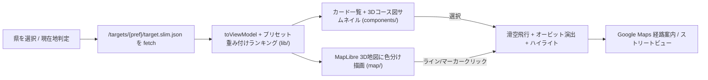

# 峠サーチャー 3D

日本全国の峠（ワインディングロード）をAI解析スコアで検索し、3D地図で下見できるWebアプリケーション。
国土地理院の地形・道路データから抽出した全47都道府県の峠データを、S3 + CloudFront から**完全静的**に配信する（バックエンド・認証なし、追加ランニングコストほぼゼロ）。

| パス | 内容 |
| --- | --- |
| `app/` | 峠サーチャー本体（Vue 3.5 + TypeScript + Vite + Pinia + MapLibre GL 5） |
| `lp/` | ランディングページ（Nuxt 3 SSG + Tailwind CSS 4） |
| `web/` `api/` `docker/` | 旧デモ（現在未使用。workspace対象外） |

ワークスペースは pnpm + Turborepo（対象は `app` と `lp` のみ）。

## アプリケーションのフロー

```mermaid
graph TB
  subgraph ユーザー
    U[ブラウザ]
  end
  subgraph "AWS (SpeedioMainStack)"
    CF["CloudFront<br/>speedio.homisoftware.net"]
    S3[(S3バケット)]
    CF -- "/ （LP）" --> S3
    CF -- "/app/* （アプリ）" --> S3
    CF -- "/targets/{pref}/target.slim.json<br/>（事前gzip済み峠データ）" --> S3
  end
  subgraph 国土地理院
    TILE["タイル配信<br/>航空写真 / dem_png / 陰影起伏"]
    GEO["逆ジオコーダAPI"]
  end
  U --> CF
  U -- "3D地形・サムネイル描画" --> TILE
  U -- "現在地→県判定" --> GEO

  subgraph データ生成（開発機）
    PY["html/build_slim_targets.py<br/>target.json → slim化+gzip"] --> S3
  end
```

アプリ内部の流れ:



## ローカル環境構築

前提: Node.js 22+ / pnpm 10+

```bash
cd product
pnpm install
pnpm dev
# アプリ: http://localhost:5173/app/
# LP:     http://localhost:3000/
```

- 峠データはローカルに不要。`app` の Vite dev サーバーが `/targets/*` を本番 CloudFront（`https://speedio.homisoftware.net`）へプロキシする。
- LPのCTAをローカルのアプリへ向ける場合: `NUXT_PUBLIC_APP_URL=http://localhost:5173/app/ pnpm --filter lp dev`
- アプリのロゴリンクをローカルLPへ向ける場合: `VITE_LP_URL=http://localhost:3000/ pnpm --filter app dev`

### 検証コマンド

```bash
pnpm test        # Vitest（ランキング計算・DEMデコード・タイル数学などの純粋ロジック）
pnpm type-check  # vue-tsc
pnpm lint        # ESLint
pnpm build       # app: dist/ , lp: .output/public/
```

## 本番デプロイ手順

インフラはリポジトリ直下 `/infra` の既存 **SpeedioMainStack**（S3 + CloudFront(OAC) + Route53 + ACM）をそのまま使う。

1. **（初回のみ）CloudFront Function の追加**
   `defaultRootObject` はルート専用のため、`/app/` へのアクセスを `/app/index.html` に書き換える
   viewer-request の CloudFront Function が必要（無料枠200万req/月で実質コストゼロ）。`/infra` のCDKに追加して `cdk deploy`。

2. **ビルド**

   ```bash
   cd product && pnpm build
   ```

3. **S3へアップロード**

   ```bash
   BUCKET=s3://speediomainstack-createbucketefe7ef15-bdy9vvhyqygf

   # アプリ（/app/ 配下）
   aws s3 sync app/dist/ $BUCKET/app/ --exclude index.html \
     --cache-control "public,max-age=31536000,immutable"
   aws s3 cp app/dist/index.html $BUCKET/app/index.html \
     --cache-control "no-cache" --content-type "text/html"

   # LP（バケットルート。既存の html/ 配信物を上書きするため要確認）
   aws s3 sync lp/.output/public/_nuxt/ $BUCKET/_nuxt/ \
     --cache-control "public,max-age=31536000,immutable"
   aws s3 cp lp/.output/public/index.html $BUCKET/index.html \
     --cache-control "no-cache" --content-type "text/html"
   ```

4. **キャッシュ無効化（index.htmlをno-cacheにしているため通常は不要）**

   ```bash
   aws cloudfront create-invalidation --distribution-id <ID> --paths "/index.html" "/app/index.html"
   ```

### 峠データの更新

`/html/build_slim_targets.py` が S3 上の `targets/{pref}/target.json` から
ビュワー用の `target.slim.json`（座標5桁丸め + gzip）を生成して併置する。

```bash
python3 html/build_slim_targets.py        # 全県
python3 html/build_slim_targets.py 24 25  # 県指定
```
