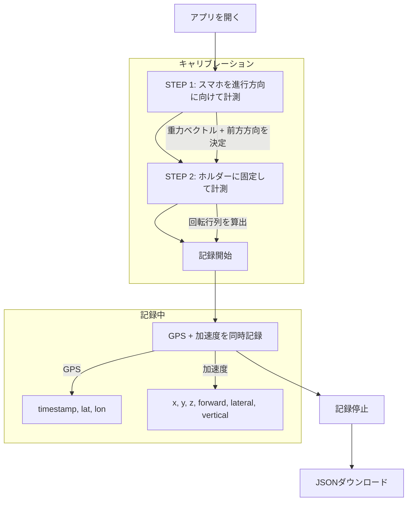

# GPS Recorder

スマートフォンのブラウザでGPS位置情報と加速度データを記録するWebアプリケーション。

## 概要

車載での走行データ収集を目的としたPWA対応のWebアプリ。GPS座標と加速度センサーのデータを同時に記録し、JSON形式でダウンロードできる。

### 主な機能

- GPS位置情報の記録（`watchPosition` による連続取得）
- 加速度データの記録（30Hz、`accelerationIncludingGravity`）
- **2ステップ加速度キャリブレーション**
  - STEP 1: スマホを手に持ち進行方向に向けて方向を計測
  - STEP 2: ホルダーに固定して姿勢を計測
  - Rodriguesの回転公式で前方/横方向/垂直方向に変換、重力除去
- JSON形式でのデータエクスポート
- GPS軌跡の可視化ツール（gps-checker）

## フロー図



## 出力データ形式

```json
{
  "gps": [
    { "timestamp": "2026-03-08T13:00:00.000+09:00", "latitude": 35.6812, "longitude": 139.7671 }
  ],
  "accelerometer": [
    {
      "timestamp": "2026-03-08T13:00:00.033+09:00",
      "x": 0.12, "y": -9.75, "z": 0.34,
      "forward": 0.08, "lateral": -0.03, "vertical": 0.01
    }
  ],
  "calibration": {
    "gravity": { "x": 0.0, "y": -9.8, "z": 0.0 },
    "forward": { "x": 0.0, "y": 0.0, "z": -1.0 },
    "lateral": { "x": 1.0, "y": 0.0, "z": 0.0 },
    "down": { "x": 0.0, "y": -1.0, "z": 0.0 }
  }
}
```

- `x, y, z`: デバイスローカル座標の生データ（重力込み）
- `forward`: 進行方向の加速度（重力除去済み、正=前方加速）
- `lateral`: 横方向の加速度（重力除去済み）
- `vertical`: 上下方向の加速度（重力除去済み）
- キャリブレーション未実施の場合、`forward/lateral/vertical` と `calibration` は含まれない

## プロジェクト構成

```
├── public/
│   ├── index.html         # メインアプリ（GPS + 加速度記録）
│   └── gps-checker.html   # GPS軌跡の可視化ツール
├── infra/                 # AWS CDK (TypeScript)
│   ├── bin/infra.ts
│   └── lib/
│       ├── main-stack.ts  # S3 + CloudFront + Route53
│       └── acm-stack.ts   # ACM証明書（us-east-1）
└── README.md
```

## インフラ構成

- **S3**: 静的ファイルホスティング
- **CloudFront**: CDN + HTTPS
- **Route53**: カスタムドメイン
- **ACM**: SSL証明書（us-east-1）

## デプロイ手順

```bash
cd infra

# .envファイルを設定
# HOST_ZONE_ID=xxxxx
# SUB_DOMAIN=gps-recorder.example.com
# DOMAIN=example.com

npm install
npx cdk deploy --all
```
